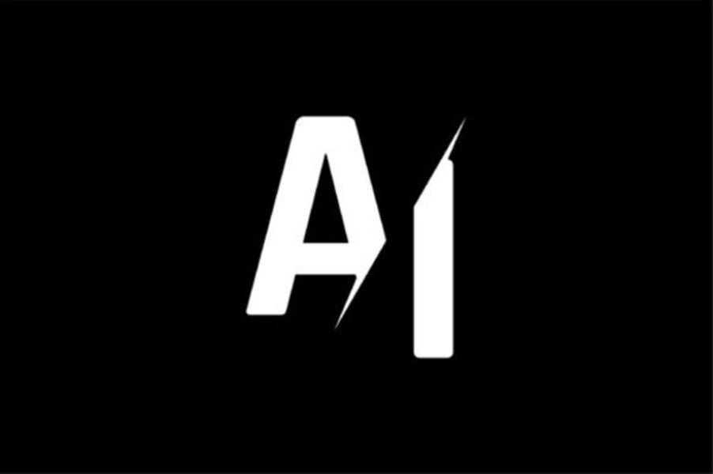

# SpecifAI

## Description succincte du projet

specifAI est un site web capable de synthétiser, expliquer et résumer n'importe quel type de fichier. Notre cible principale étant les experts-comptable notre solution pourrait par exemple les aider en synthétisant des livres de comptes entiers.

## Quel est le but du projet ?

Nous sommes parti du constat que dans notre domaine il est compliqué de faire comprendre à un néophyte certains aspects de notre travail ou certains termes trop techniques. Nous avons également remarqué que ces explications peuvent trainer dans la longueur et devenir de moins en moins claires. C'est pour répondre à ces problématiques que nous avons imaginé specifAI.
specifAI permettra à tous ses utilisateurs de faciliter la création et la simplification des explications dans n'importe quel domaine. Notre solution permettra également aux utilisateurs qui ont reçu des explications trop compliquées ou trop longues de les faciliter ou de les résumer. Nous offrons également la possibilité à l'utilisateur de spécifier le sujet exact dont il nécessite l'explication au sein du document, ce qui lui permettra de recevoir des explications plus ciblées.

## Membres

- Théo Millasseau: Chef de Projet et développeur IA
- Paul Gazeau-Rousseau: Manager technique IA et développeur IA
- Nykyta Kudrya: Développeur web
- Paul Rosenkranz:  Manager technique web et Développeur web 
- Corenting Langlois: Développeur IA
- Kevin Ziliox: Développeur Web